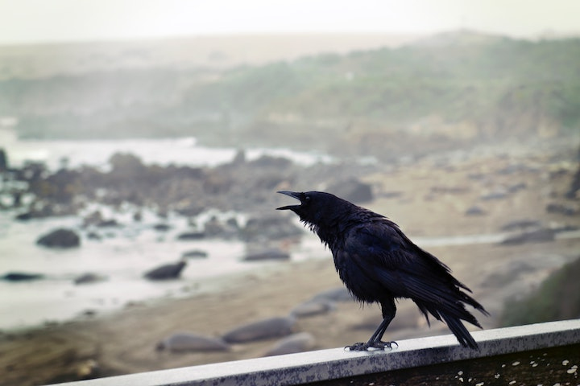

# Sample Unit Format

## Overview {-}

In this first unit, we begin the course by...  

### Topics {-}

1. Topic  
1. Topic  
1. Topic  
1. Topic  

### Learning Outcomes {-}

When you have completed this unit, you should be able to:

- Describe...
- Contrast...
- Analyze...
- Determine...
- Create...

### Activity Checklist{-}

Here is a checklist of learning activities you will benefit from in completing this unit. You may find it useful for planning your work.

```{block2, type='reflect'}

<span class="blockhead">Learning Activities </span>

- Chapter 1: sections 1.1, 1.2, 1.3 of the course text *Principles of Management.*  
- Read or listen to the blog post from Bill Davis, *5 Principles of Great Management*, and reflect on the chart provided.  

```

```{block2, type='assessment'}

<span class="blockhead">Assessment</span> 

- Unit 2 Team Memo  

```

### Resources {-}

Here are the resources you will need to complete this unit.

- Bright, D. S. & Cortes, A. H. (2019). [Principles of Management](https://openstax.org/details/books/principles-management){target="_blank"}.  
- Other online resources will be provided in the unit.  

## Topic 1 Title

[Add content]



### Activity: Introductory Readings & Video {-}

```{block2, type='reflect'}

- Read ...  
- Watch this short informative video that helps you understand the competitive environment by using the case of Amazon books Vs. Independent bookstores.  

[Watch: *The Competitive Environment Explained*](https://www.youtube.com/watch?v=XIt7dEmo4D8){target="_blank"}

<div class="video-container">

<iframe width="560" height="315" src="https://www.youtube-nocookie.com/embed/XIt7dEmo4D8" title="YouTube video player" frameborder="0" allow="accelerometer; autoplay; clipboard-write; encrypted-media; gyroscope; picture-in-picture; web-share" allowfullscreen></iframe>

</div>

<span class="blockhead">Questions to Consider<span class="prote">

After watching the above video, consider the following questions:

- ...  
- ...  

**Note:** *Learning activities in this course are ungraded, unless specified. They are designed to help you succeed in your assessments in this course, so you are strongly encouraged to complete them.*

```

## Topic 2 Title

[add content]

## Topic 3 Title

[add content]

## Unit 1 Summary {-}

[add content]

## Assessment{-}

```{block2, type='assessment'}

<span class="blockhead">Assessment 1 Title</span>

- Do a thing  
- Do another thing  

<span class="blockhead">Assessment 2 Title</span>

- Do a thing  
- Do another thing  

**Note:** *This is an example of a note pertaining to an assessment*

```

### Checking your Learning{-}

```{block2, type='progress'}

Now that you have completed the learning activities and assignments for this unit, check the unit learning outcomes below to see if you are able to do the following:

- Describe...  
- Contrast...  
- Analyze...  
- Determine...  
- Create...  

Feel free to review topics more in depth or continue on to the next unit.

```

```{block2, type='caution'}

**Sample courses:** 

- [LDRS 375](https://ba-leadership.github.io/ldrs375/){targt="_blank"}  
- [LDRS 440](https://ba-leadership.github.io/ldrs440/){target="_blank"}  

```