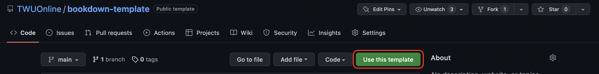
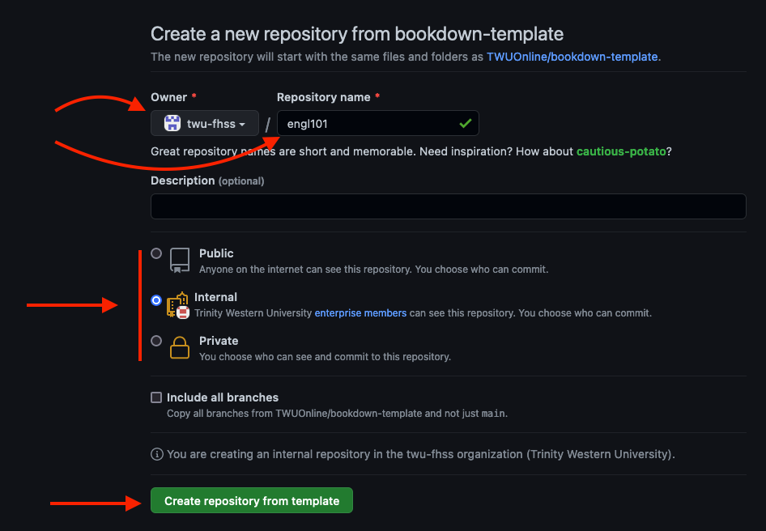
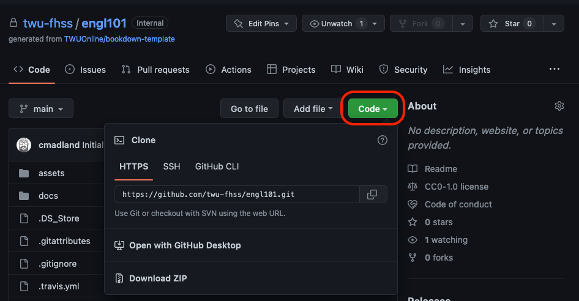
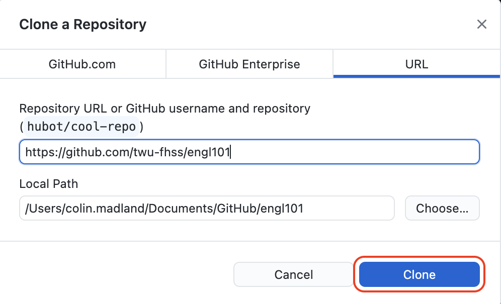
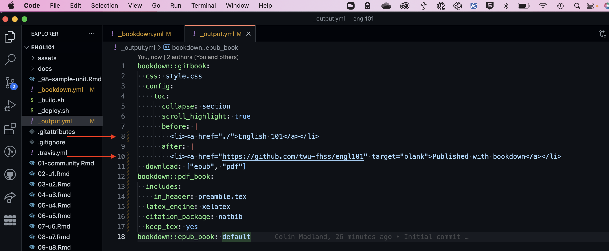
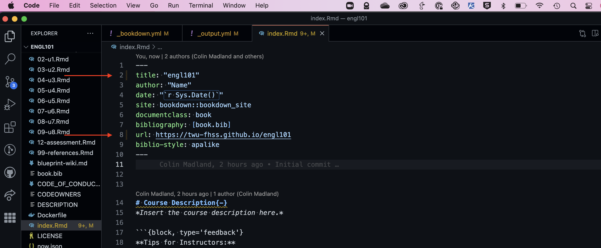
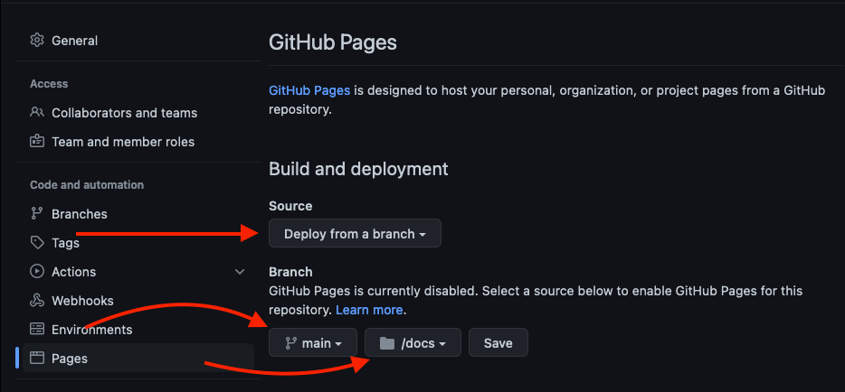
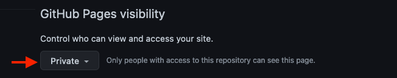

# About this Site

This is a minimal example of a course site based on R Markdown and **bookdown** (<https://github.com/rstudio/bookdown). Please see the page "[Get Started](https://bookdown.org/yihui/bookdown/get-started.html)" for how to compile this example into HTML. You may generate a copy of the book in `bookdown::pdf_book` format by calling `bookdown::render_book('index.Rmd', 'bookdown::pdf_book')`. More detailed instructions are available here <https://bookdown.org/yihui/bookdown/build-the-book.html>.

[You can find the preview of this example here.](https://twuonline.github.io/bookdown-template)

## Benefits of Bookdown for hosting course sites

- All of your course content is composed in plain text files and styled with Markdown, making your course materials highly interoperable with multiple web applications.  
- Your course content is in a decentralized version control system meaning that all changes are tracked and conflicts, if they arise, are managed manually. This means that you, as the author of your content, can determine which content to keep in the event of conflicting updates.  
- You are able to edit your course files locally (offline, on your own computer), then syncronize when you are ready and have online access.  
- You have the option of rendering your content in a variety of formats, giving you flexibility in how you share your content. Commons formats include HTML, PDF, MS Werd, ePub, and the original Markdown files. This can allow you to send your course as a single file through email, allow users to download the file for offline use, and keep snapshots of different versions of your course.  
- Collaboration is built-in to the GitHub workflow, so if you are working with a team, everyone has access to the most up-to-date version of the content.  
- GitHub has robust and improving project management tools including issues and highly customizable projects with embedded metadata such as labels, milestones, the ability to assign issues, task lists, and the ability to create custom metadata fields.  
- Markdown files are inherently more accessible because everything is tagged with a style, rather than having text formats applied to mimic styles.  
- Your course site comes with accessibility tools allowing users to customize their own experience (light and dark themes, text size, text style)  
- Ability to embed multi-media directly from popular sites like YouTube and Vimeo, but also indirectly through embedly.com.  
- You are able to embed your course book in other web tools such as learning managememnt systems or WordPress.  
- Host your course site for free with Github Pages.  
- Host private course sites (your site is only accessible to members of the repository) if you have a Pro, Team, Enterprise Cloud, or Enterprise Server account.  
- [Inline or blocked LaTeX](https://bookdown.org/yihui/bookdown/markdown-syntax.html#math-expressions) equations are supported.  
- [Embed R code chunks or inline R code](https://bookdown.org/yihui/bookdown/r-code.html#r-code) to create dynamic, automatically-updating tables and figures.  

## Using this Template

You are free to use this site as a template to build your own course site using Bookdown. There is some work up front, but we have found the payoff to be significant.

### Requirements

- A GitHub account  
  - If you are using a free GitHub account, you will only be able to create a public repository and site.  
- Working knowledge of creating content formatted in Markdown, or a willingness to learn...it's pretty easy.  
- Basic knowledge of how to use GitHub for version control.  
- Current version of [R](https://cran.r-project.org/) and [RStudio Desktop (Open Source Edition)](https://www.rstudio.com/products/rstudio/).  
  - Note that you don't need to know or learn any R programming to use this template. You will need to install a couple of plugins, and be able to click a button every once in a while.  
- Current packages to install in RStudio are:  
  - `bookdown`  
  - `markdown`  
  - `Rmarkdown`  

### Recommendations

If you want to work offline, you should download and install the following.

- [GitHub Desktop](https://desktop.github.com/)  
- [Good] a plain text editor (NotePad, TextEdit, Typora...)  
- [Better] a plain text editor that has built-in Git functionality (VSCode, Atom)  

### Clone the Template

### Repository Settings

- Choose an owner and repository name, according to your context.  
- Set the visibility and access level.  
- Click 'Create repository from template'.  

You will see a screen showing that the repository is being generated, then will be taken to your new repository. This usually only takes several seconds, but your network connection may be slower or faster.

### [Optional] Clone the Repo

We recommend that you clone the repository to your own computer so that you can work offline and have greater flexibility.

#### Click the green 'Code' button

- Click 'Open with GitHub Desktop'  

#### Choose the path to where you want to save the files and click 'Clone'

#### Fetch and Open

- Click 'Fetch origin'  
- Click 'Open in [Visual Studio Code - or Atom, as appropriate]'  

At this point, you will have generated an exact copy of the template, but there are some settings you will need to change to customize the repo to your needs. 
### Edit `_bookdown.yml`

On line 1, change "Template" to "engl101" or whatever fits your context.

### Edit `_output.yml`

Edit lines 8 and 10 to match your context.

### Edit `index.Rmd`

Edit lines 2 and 8 to match your context.

### Rename `template.Rproj` to `engl101.Rproj`

### Build your book.

In VSCode or Atom, right-click on `engl101.Rproj` and choose 'Show in Finder' or 'Reveal in Explorer' to navigate to the file on your system, then double-click to open the file in RStudio.

Once you have opened the file in RStudio, click the 'Build' tab and then 'Build Book'.

Once your book has been built, you can push your changes to Github.

### Set up GitHub Pages

In the GitHub.com repository, click 'Settings', then 'Pages'.

- Keep the source as 'Deploy from a branch'.  
- Set the Branch to 'main'  
- Set the Folder to '/docs'  
- Click 'Save'  

- confirm visibility settings
  - if you keep the site private, only signed-in GitHub users who have access to your repository will be able to see the site

#### Visit the [Bookdown.org](https://bookdown.org/yihui/bookdown/) site for further details about using bookdown.

### Styling

You can edit the `style.css` file to adjust the CSS styling of blocks as they appear in html, and the `preamble.tex` file for styling blocks in the PDF output.

### Managing a course design project with Bookdown

We have created a wiki in the source repo to host our blueprinting process, but since the wiki isn't included when you copy the template, we have included a file called `blueprint-wiki.md` which you can modify and use for your own process.